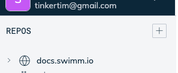
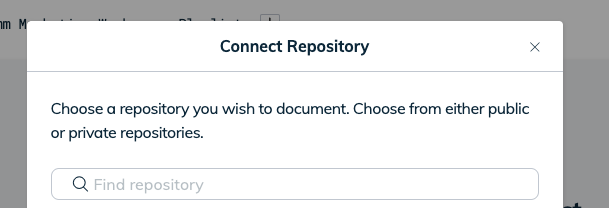
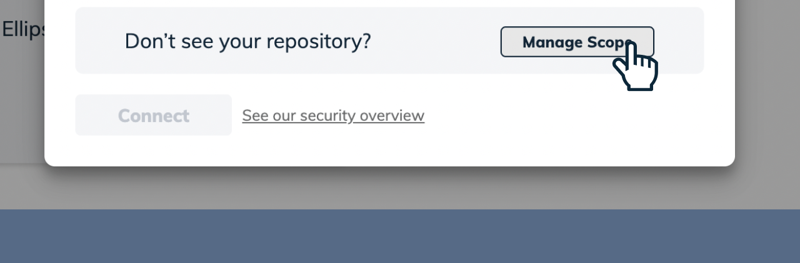

import useBaseUrl from '@docusaurus/useBaseUrl';
import Link from '@docusaurus/Link';

# Connecting Repositories To Swimm

Once you've authenticated and created your first <Link to="/docs/creating-content/workspaces">workspace</Link>,
you'll need to add your repositories that you want to document.

From the main workspace menu, on the left side, click the plus sign next to "REPOS":

Next, a dialog will open allowing you to select from public, private, and organizational 
repositories with GitHub:

Just select the repos you wish to add. Note, if you have dozens or more repositories,
it might take a moment for the list to load. 

If you don't see the repository you wish to add, it's because Swimm doesn't have the 
correct <Link to="/docs/authorization/github-auth">permissions</Link>. You can fix that
by clicking the Manage GitHub Scope button at the bottom of the dialog box:

If you still can't find the repository at this point, please reach out to
support for additional assistance.
