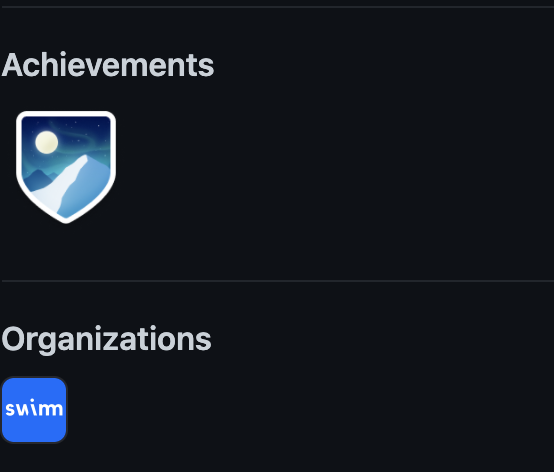

import useBaseUrl from '@docusaurus/useBaseUrl';
import Link from '@docusaurus/Link';

# GitHub Sign In & Authorization

We try to make signing in as frictionless as possible. However, Swimm can't
control the entire experience, so we've put together a short list of things
that are handy to know in advance.

## Making sure you use the correct account

It is very likely that you'll receive an invitation to join a workspace to your work email address. You should sign up for Swimm with that email address
where you received the invite. When requested to add GitHub authorization, make 
sure you sign into GitHub with whatever account is part of the organization
that owns the code you need to document. In most cases, this is likely to be 
your personal GitHub account.

A handy way to tell in advance is to open your GitHub profile page, which is
found at `https://github.com/your-githuyb-username`. At the bottom-left side
of the page, you'll see a section for Achievements and Organizations:

:::info Example Github Profile Excerpt Showing The Swimm Organization

:::

If you see *your* company logo there, it means you're logged in to the correct 
account and that's the account you should use when you follow the invite link.

## Selecting the correct repos & permissions

As explained in <Link to="/docs/authorization/permissions">permissions</Link>, Swimm
is going to need access to the organization that owns the repositories, as well
as access to the individual repos themselves.

You can manage this access in GitHub.

## Sometimes loading GitHub's response takes time

If you have a lot of repos associated with your GitHub account and organization,
it can sometimes a minute for GitHub to return a response. If there is a timeout, we'll report it and give you an option to
try again. This seldom happens, and if it does, it will only happen when the admin
user initially sets up a workspace. 
