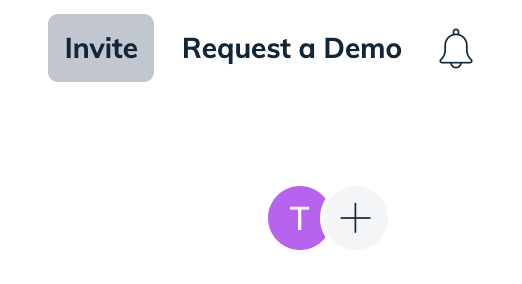

import useBaseUrl from '@docusaurus/useBaseUrl';
import Link from '@docusaurus/Link';

# Inviting Other Colleagues To Use Swimm

In your main <Link to="/docs/creating-content/workspaces">workspace</Link> menu, you'll see the following
functionality at the top-right of the screen:

## What email should I use?

In most cases, you want to use their work (or organizational) email address. They'll receive a link
to the workspace where we'll prompt them to sign in with their Github account, and a link to our
Quick Start video. 

## What if they don't receive the invitation?

Swimm uses a very reliable email provider to avoid just these sorts of instances. If they've checked
all of their folders and can't find it, you can cancel the pending invitation by clicking the invite
link again, looing for their invite in the dialog, and canceling it. You can then re-invite them.

If that doesn't work, please reach out to support. 
