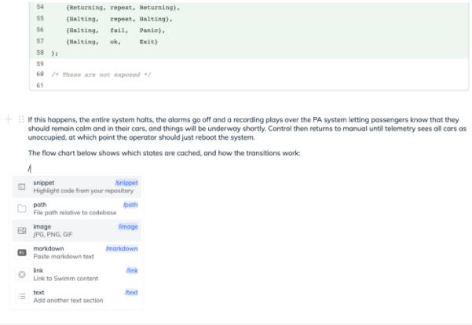
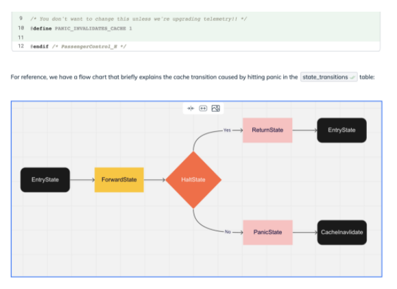

import useBaseUrl from '@docusaurus/useBaseUrl';
import Link from '@docusaurus/Link';

# Swimm Editor Features

Swimm Editor facilitates writing documentation.

:::tip Further Reading
We've <Link href="https://swimm.io/blog/advanced-documentation-editor-how-to-create-code-coupled-docs-in-seconds/">
got a great blog post just about the editor</Link> that talks more about
how it came to be.
:::

## Components are just a `/` away

All of the features are easily accessed by pushing the `/` key. This brings
up a menu that you can select what you want to include.

We recommend grabbing a bunch of code snippets to get started. They'll provide
a useful start to write the narrative that walks someone
through the code.

## Bring helpful context through the Snippet Studio

It's very easy to bring in code from multiple files together in the same document.
This is useful for teaching someone how different parts of the code
come together when it runs. 

A useful example are client code and stylesheets, referencing how models work
within the controllers that call them, or any other time where you need to teach 
how things fit into the larger picture in addition to how individual functions and
methods work. 

## Make documentation people will want to own

When creating documentation, including flow charts and diagrams is helpful for others to
understand what you are trying to describe. Images, videos, and GIFs also makes documentation
easier to consume. This makes it more valuable to people on your team, which hopefully
means everyone will be more inclined to improve it and create even more.

