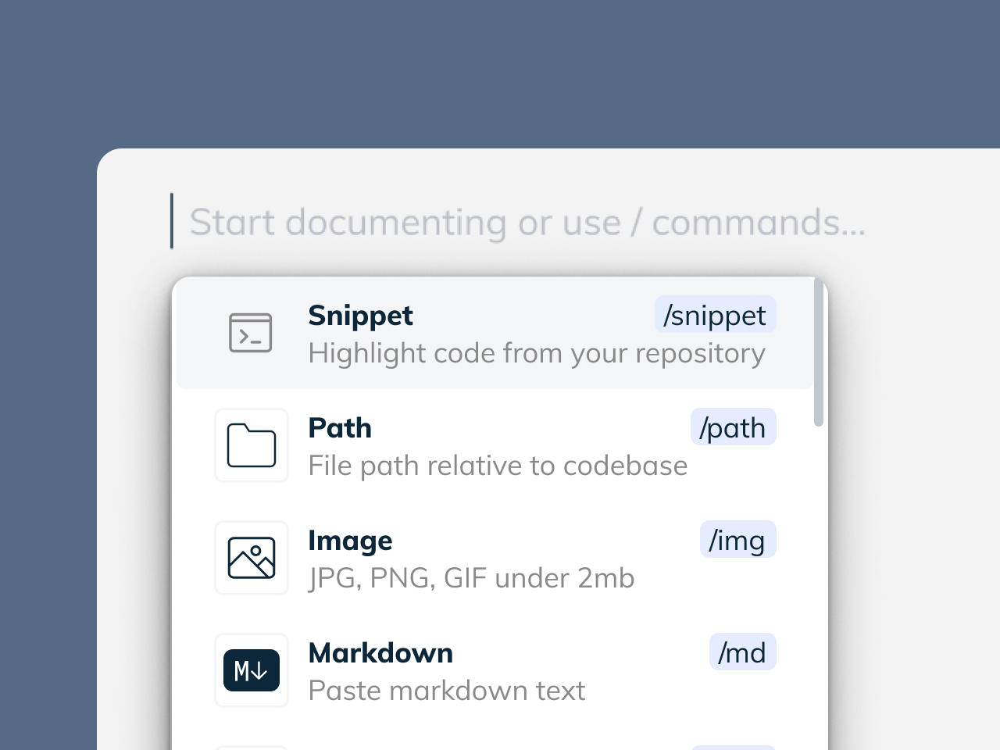

import useBaseUrl from '@docusaurus/useBaseUrl';
import Link from '@docusaurus/Link';

# Swimm's Fluid Editor Features

Our fluid editor makes writing great documentation enjoyable for many, and 
bearable for those that really do not like to write. It's simple to use, 
it's free of any unnecessary distractions, it helps you write by turning
your own code into scaffolding to guide you, and it tries very hard to
keep your hands on the keyboard whenever possible. 

:::tip Further Reading
We've <Link href="https://swimm.io/blog/advanced-documentation-editor-how-to-create-code-coupled-docs-in-seconds/">
got a great blog post just about the editor</Link> that talks more about
how it came to be.
:::

## Components are just a `/` away

All of the features are easily accessed by pushing the `/` key. This brings
up a menu that you can arrow through and select what you want to include.

We recommend grabbing a bunch of code snippets to get started; they'll provide
a useful scaffolding for you you to write the narrative that walks someone
through the code.

## Bring helpful context through the Snippet Studio

It's very easy to bring in code from multiple files together in the same document.
This is incredibly handy for teaching someone how many different parts of the code
come together at one point in time when it runs. 

Great examples of this are client code and stylesheets, referencing how models work
within the controllers that call them, or any other time where you need to teach 
how things fit into the larger picture in addition to how individual functions and
methods work. 

## Make documentation people will want to own

Flow charts and diagrams can very often help your readers be certain that they
understand the documentation as you intended. Mixed media also makes documentation
easier to consume. This makes it more valuable to people on your team, which hopefully
means everyone will be more inclined to improve it and create even more.

Don't forget to play with the fun bits, otherwise, well, you won't have any fun.
