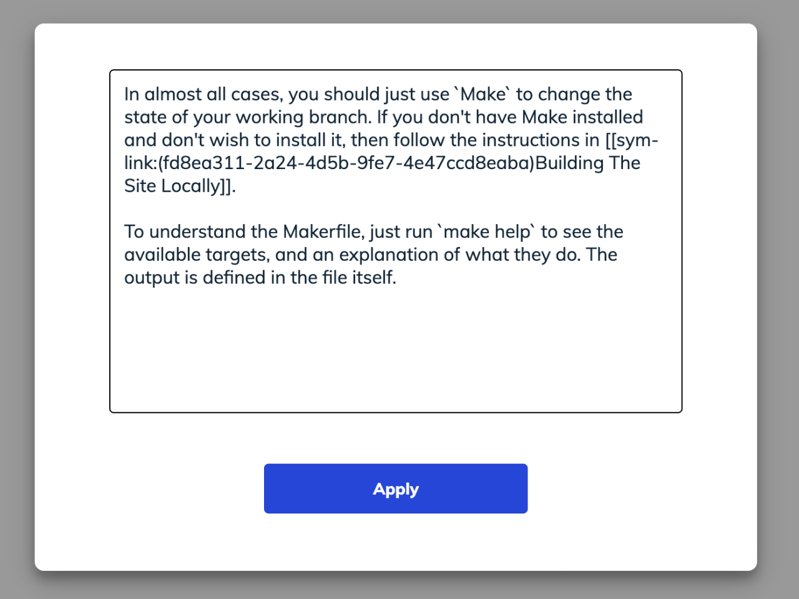

import useBaseUrl from '@docusaurus/useBaseUrl';
import Link from '@docusaurus/Link';

# Importing & Linking Existing Markdown

There are currently several ways of linking/importing existing text/Markdown
documentation into Swimm, and we're currently developing features to make this
more frictionless and better supported. 

## Paste through the Swimm Editor

Open the `/` menu and select "Markdown" from the slash menu:

This will open a text box with the contents of the text area that you're working 
in. You can then paste the Markdown copy wherever you'd like it to appear and
close the dialog. 

If you want to paste it all on its own, just create a new text segment from the
slash menu and then paste it in. You can drag it around once you exit the dialog.

## Link to text files in Swimm documents

From the `/` slash menu, select "Path" and then select the file you'd like to link.
It'll appear and automatically keep
in sync with the file location. 

## Link to text files in playlists

You can insert links to any files in the repo within Playlists, as well as hyperlinks.
