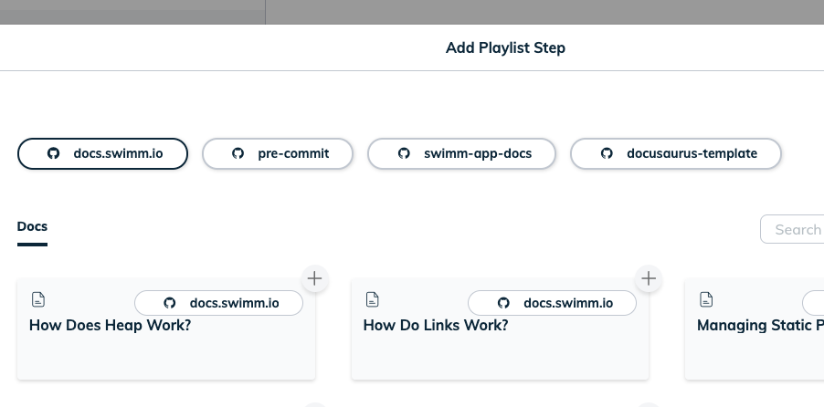
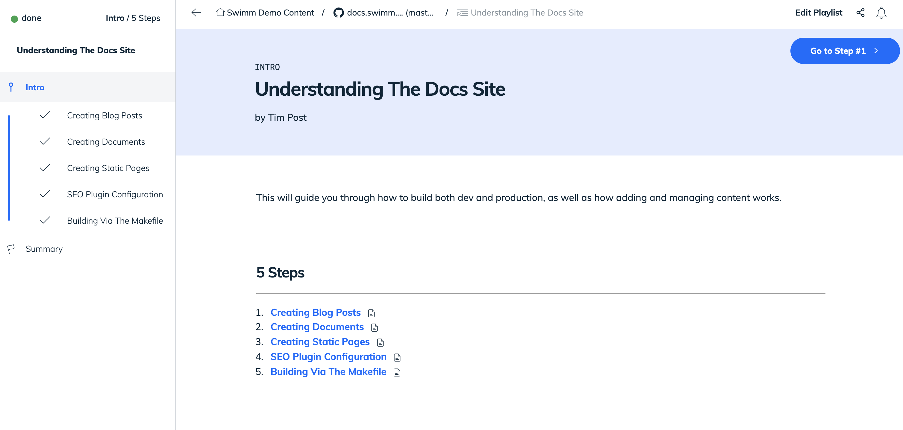

import useBaseUrl from '@docusaurus/useBaseUrl';
import Link from '@docusaurus/Link';

# Swimm Playlists

Swimm Playlist are a collection of documents, links, videos, Markdown files, and images that you put into a Playlist collection in a particular order intended to help facilitate the onboarding of new developers. Swimm keeps track of what you’ve covered in a Playlist so you don’t have to remember where you left off.

## Creating & editing Playlists

To create a Playlist, navigate to "New Playlist" from the repo page.

Click on the plus sign to the left of the page to add steps. This will bring up a pop up for you to select the things to include. Toggle between "Docs" and "Links" to select the type you want.

## Working through Playlists

Open a Swimm Playlist. At the 
bottom of every page you'll see an option to mark it as read. You can stop at any point as Swimm will remember where you left off. 

## Adding a Playlist to a doc or adding another Playlist
In the Swimm Editor, type "/" to show the editor options. 
Choose "Playlist" and navigate to the Playlist you'd like to select.