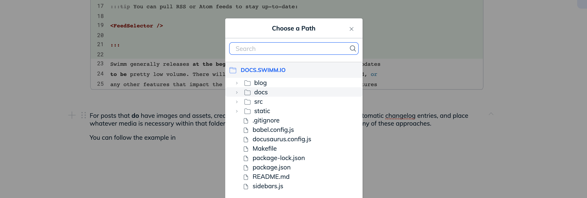
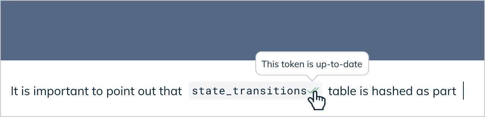
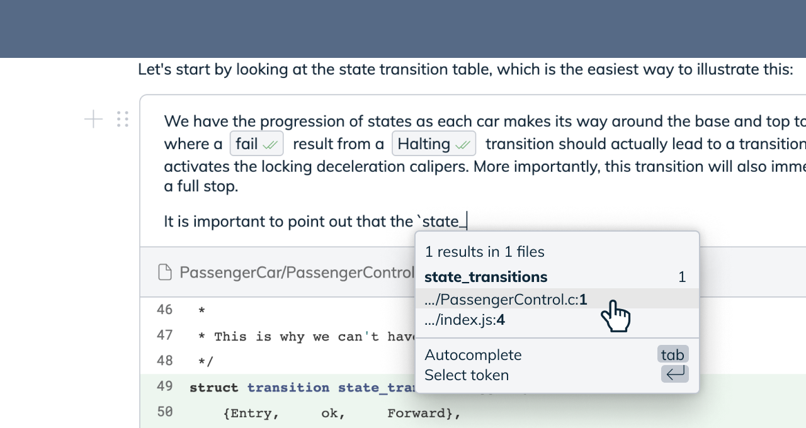

import useBaseUrl from '@docusaurus/useBaseUrl';
import Link from '@docusaurus/Link';

# Smart Tokens & Paths

Smart Tokens and Paths in Swimm help your documentation stay in sync
through refactoring and reorganization. With Smart Paths, you don't have
to worry about changing file names or even directory structure around. 
Swimm will be able to keep up with it. 

With Smart Tokens, you won't need to worry about the impact of
refactoring on your documentation and renaming constants or variables. Even
class and method names won't cause you to need to update your documentation
everywhere they're mentioned. 

## How do Smart Paths work?

You can insert a Smart Path in your doucment throught the `/` slash menu in
the editor. Select "Path" and then select a file or directory that you'd like
Swimm to keep track of for you. 

As long as you use `git mv` to move things around, Swimm will automatically 
sync the links. The path will appear as a hyperlink in your document that 
allows people to browse the content.

## How do Smart Tokens work?

Smart Tokens are a feature that lets you reference parts of your code even outside of
snippets in a way that automatically updates when the code changes. The most common use
for Smart Tokens is referencing variable, method, or function names within the document.

To create a Smart Token, you first need to add a snippet containing the token you want to track. 
Then open a backtick <code>\`</code> and start typing. Swimm will autocomplete based on
code you've referenced.

Swimm is working to not require snippets to create Smart Tokens, and we will announce when this is possible.

## Do Smart Tokens have the concept of types?

No. Tokens are watched based on the shape and nature of the way they change. While 
you might think Swimm understands types by the way it syncs a change from something
like `(void **)` to `(mytype_t **)` or strings to integers, it's really just 
tracking the change in context and the token itself. 

While there may theoretically be some limits to this approach, we have yet to hit
them, and the approach lends very well to our language-agnostic design.
