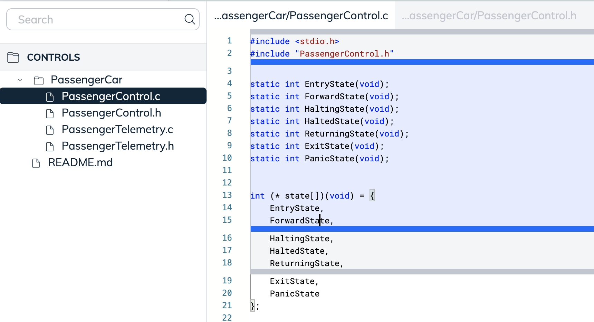

import useBaseUrl from '@docusaurus/useBaseUrl';
import Link from '@docusaurus/Link';

# Understanding Swimm's Snippet Studio

Swimm's Snippet Studio is the primary way for Swimm to couple documentation to 
code. We make it easy to include snippets from as many source & text files 
as you need to bring someone up to speed on the flow of the code quickly. 

## How does snippet selection work?

The snippet studio opens with a tree view of your repository. There, you select 
a file that has some code that you want to teach. You can grab links on-the-fly
by searching for it.

Open a snippet to begin with, and highlight the code that you want to bring into the 
document. Blue lines are the code that you want to focus on, while the gray lines
indicste the context selection, or lines of code that will be shown before and
after the blue highlighted area. 

Every unique file for the snippets your document contains will appear as tabs
at the top of the studio. This makes it easy to organize your writing flow. 

Every time you press "Add To Document" the highlighted code is added. The studio
will remain open allowing for more selection until you press escape, or click 
outside of the studio top. 

## How many snippets can I have?

As many as you want. Imagine that each snippet of code is like a drop of glue
holding your code and documentation together. The more it's coupled, the better
it's going to be, and be all the more helpful to newcomers. We're sure there's
got to be some limit, but it's a really big number. 

