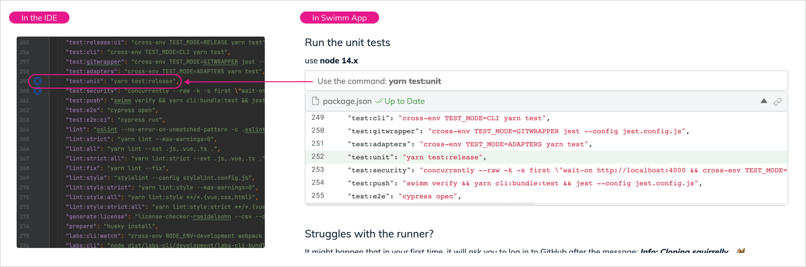

import Link from '@docusaurus/Link';
import useBaseUrl from '@docusaurus/useBaseUrl';

# IDE Plugins - Jetbrains
Our JetBrains IDE plugin version and feature set is older than our VS Code extension at the moment.

### Step 1: Install
Get Swimm’s <Link href="https://plugins.jetbrains.com/plugin/17201-swimm">JetBrains plugin here.</Link>

### Step 2: Explore
Using your favorite JetBrains IDE, you will see a **buoy icon**. 
Hover the icon to see the associated document relevant to that line of code.

Click the bouy to open Markdown, and begin exploring away!

:::tip Tip
Get the best out of your Markdown files and install the <Link href="https://marketplace.visualstudio.com/items?itemName=ms-vscode.live-server"> Live Preview VS Code Extension.</Link>
:::
