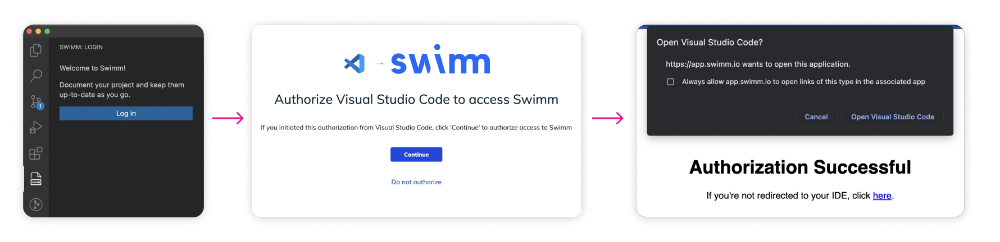
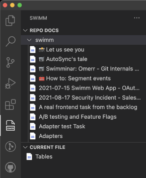
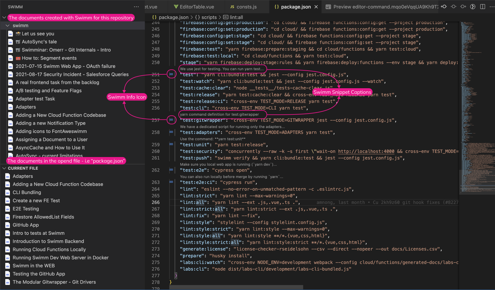
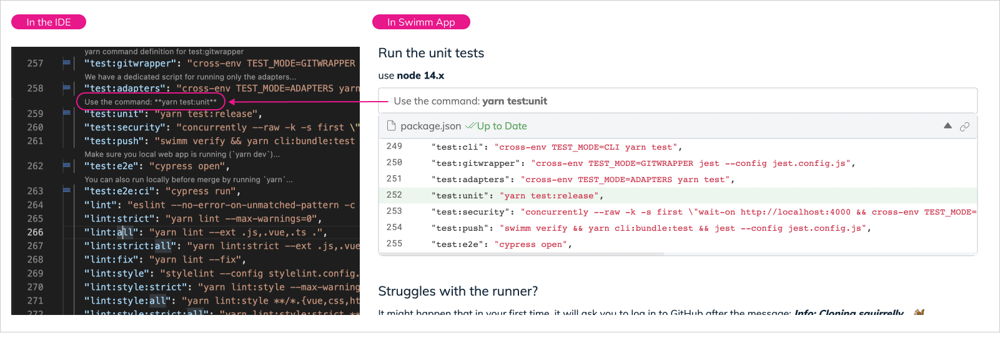
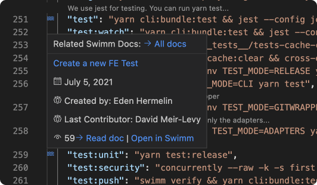

import Link from '@docusaurus/Link';
import useBaseUrl from '@docusaurus/useBaseUrl';

# IDE Plugins - VS Code

### Step 1: Install
Get your Visual Studio Code extension <Link href="https://marketplace.visualstudio.com/items?itemName=Swimm.swimm">here</Link>

### Step 2: Log in

**Login:** Once installed, you will see Swimm's panel in your IDE. 
**Authorize:** In your browser, authorize Swimm.

### Step 3: Explore
#### Swimm Sidebar
Swimm’s sidebar, featured on the left side of the page, is set up as a documentation page tree in alphabetical order for all your docs. If you have created code-coupled documentation with Swimm,  you will see a list of those docs.

 
Click on an item will open the Markdown.

:::tip Tip
Get the best out of your Markdown files and install the <Link href="https://marketplace.visualstudio.com/items?itemName=ms-vscode.live-server"> Live Preview VS Code Extension.</Link>
:::

#### Features

Once VS Code is installed and you’ve logged in, begin exploring away! 

#### Current File
Under "Current File," you'll see documents associated with code file that you are working on. 

#### Code Hints

With Swimm, you add snippets and comments to documentation. These comments function as “code hints'' to help you consume documentation in the context of your codebase. 

When you hover over the Swimm icon, you see the doc name and metadata all related to this particular piece of code.  

:::tip Tip
Look at the names under “Created by” and “Last Contributor” to find out who has the most current knowledge related to a section of the code. 
:::
