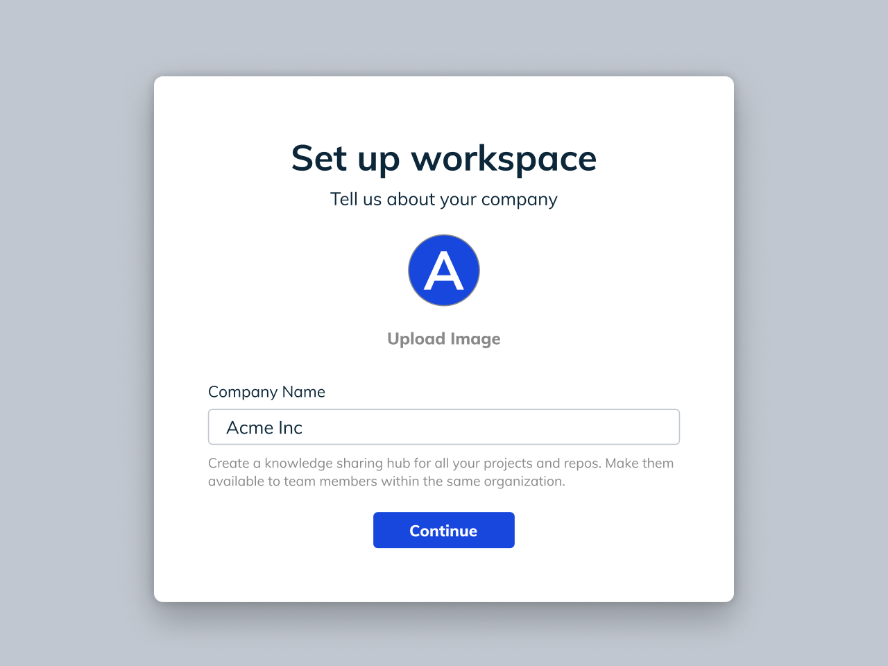
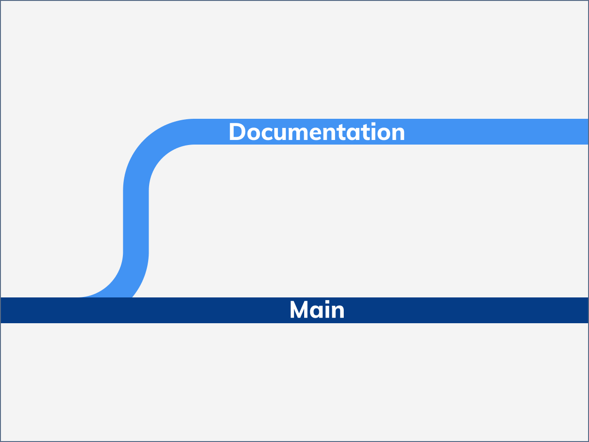
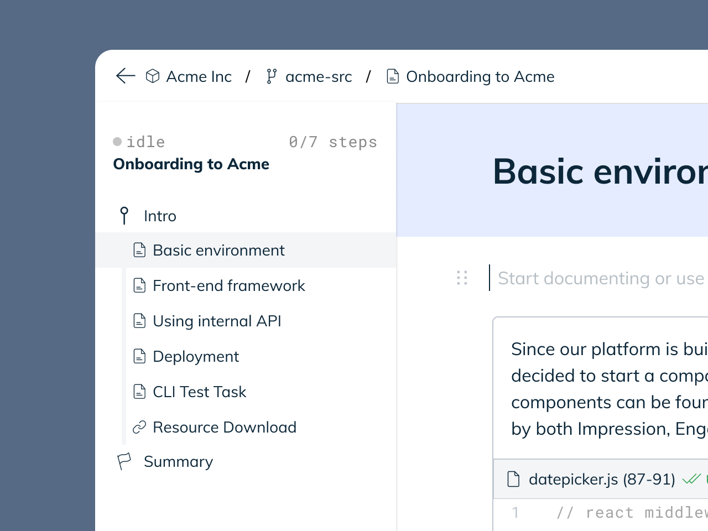
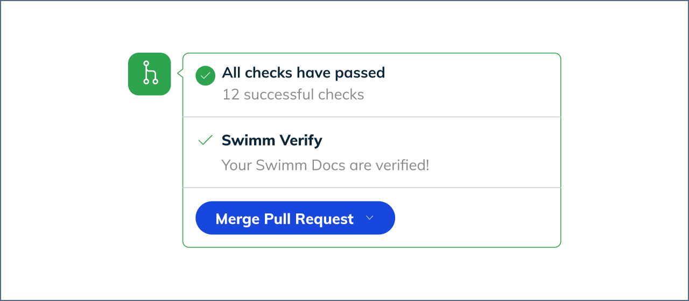
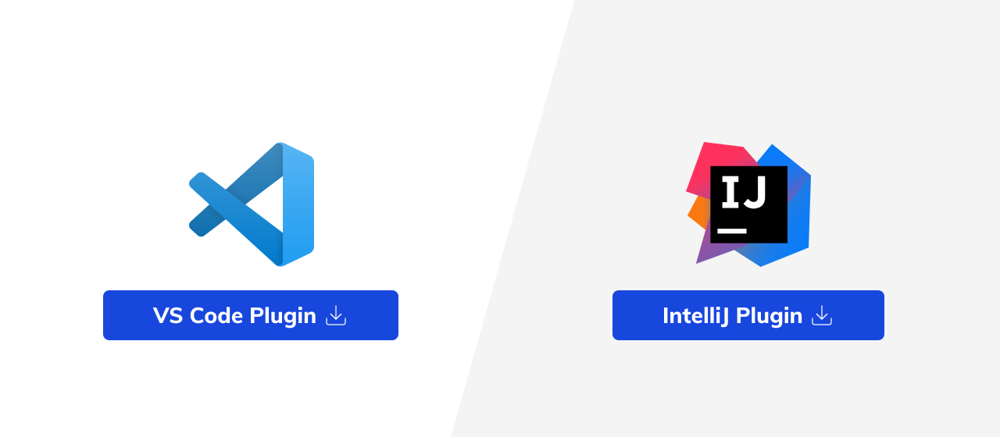
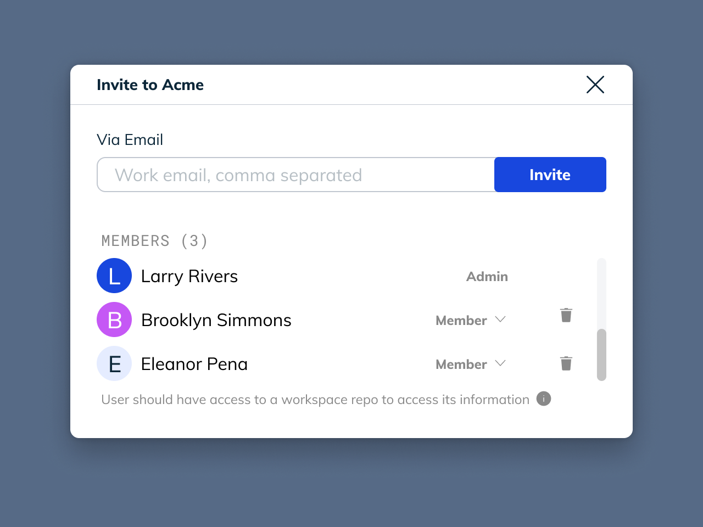

import Link from '@docusaurus/Link';
import YouTubePlayer from '../src/components/YouTubePlayer.js'

# Fifteen Minute Quick Start Guide

**We never see your code or store your Github token. See our <Link to="/github">Security Overview</Link>
for more information.**

This guide shows you how to sign up, connect your GitHub account, 
give Swimm the permissions it needs to work, and create your first Swimm 
document. Then we show you how to keep your documentation up-to-date and how to make your documentation discoverable 
just-in-time through our IDE plugins. This will give you a great sense of 
Swimm's functionality and feel, and start your thinking on ways that you 
can integrate it.

Here are the milestones you need to accomplish:

## Set up a workspace

A workspace in Swimm is a logical grouping of repositories associated with a team.
Many organizations only need a single workspace, and we recommend starting with just
one until the need for more becomes clear.

Example use cases for multiple workspaces might be:

 - One workspace per micro-service
 - Separating concerns, like "The Front End Team," "The Back End Team," "The Internal Dev Team," "The Data Team"
 - Student or volunteer groups managing translations, etc.

## Understand how branching impacts your workflow

Swimm uses Git to store your documentation in the `.swm` folder of each repository
where you use Swimm. This means that documentation that you write needs to be committed
and merged just like anything else. 

You can decide whether to create documentation on a side branch and open a PR to merge it to the main 
branch.

You can still commit directly to the main branch if it isn't protected, but we
strongly recommend utilizing the PR as an additional layer of safety and 
review. 

## Create your first document with smart paths & tokens

Pick something that requires documentation and write up a short
tutorial on how to accomplish it. Use the list below for inspiration:

 - How do I write a unit test?
 - How do I set up my local build environment?
 - How do I debug a service too big for Minikube?
 - How do I integrate a third-party service?

 Now, grab some snippets from relevant files (e.g. an example unit test) and add them to
 your document.

 Now, fill in the narrative. Hit the `/` key when the cursor is by itself to bring up 
 a quick menu. Try smart paths - these auto-sync if the path ever moves. Try using some
 smart tokens to call out variables, functions or methods and you won't need to worry
 if they ever change. 

## Create your first Swimm Playlist

Once you've documented one or two simple things that anyone onboarding to the code would
appreciate knowing, it's time to create a playlist to orgainze those documents.

Create a "Getting Familiar" playlist and try adding the documents you just created, as well
as links to any existing README files you might have, or even videos, flowcharts or funny 
memes to lighten the mood. 

## Set up Continuous Documentation

To set up Continuous Documentation, make sure Swimm Verify is running on your CI pipeline through our GitHub app, or
by using one of our sample configurations for popular CI servers. Talk with your team
and decide what your best action is if a PR breaks the documentation. 

If you don't use continuous integration, please consider taking advantage of commit hooks
to make sure your documentation stays up-to-date.

## Try our IDE plugins

Swimm's IDE plugins provide access to your documents right inline with the code
that they explain, and your documentation opens right in the IDE. This is an example of how Swimm augments your existing code
comments conveniently so you don't have to look for them. 

## Invite others to your workspace

Many hands make light work! Use the "invite" feature on the workspace page to invite others
on your team to enjoy and create great documentation along with you.

It's also helpful to keep the workspace permalink available in your internal wiki or service
catalog.  

